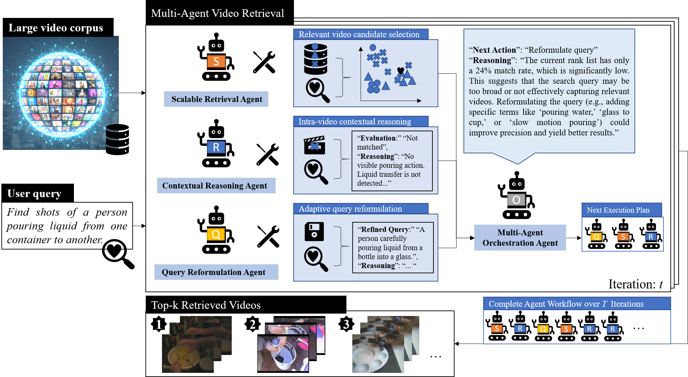

# Multi-Agent Retrieval

This is the official implementation of the peper entitled "[Adaptive Multi-Agent Reasoning for Text-to-Video Retrieval](https://arxiv.org/abs/2602.19040)", which is accepted in ACM ICMR 2026.

This paper is mainly about improving **zero-shot text-to-video retrieval** on large video corpora, especially for **complex queries** that require temporal, logical, or causal reasoning (e.g., “A happens before B”, “because”, “after”, “then”). It tries to solve a key failure mode where a single retrieval model can align text and video globally, but often struggles with **query-dependent temporal reasoning** and ambiguity in natural-language queries. The proposed solution is an **adaptive multi-agent framework** that iteratively coordinates specialized agents (retrieval, contextual reasoning, query reformulation) via an orchestration agent, enhanced with **retrieval-performance memory** and **historical reasoning traces** to guide better decisions over multiple iterations.



## Overview

This multi-agent retrieval has three specialized agents and one orchestration Agent:

1. **Retrieval Agent**: Performs initial and iterative video retrieval using search models (ViCLIP, CLIP, or IITV). Handles embedding-based similarity search and concept-based retrieval.

2. **Contextual Reasoning Agent**: Uses MLLM (e.g., Qwen3-VL) to examine retrieved videos, score their relevance to the query.

3. **Query Reformulation Agent**: Uses MLLM (e.g.,Qwen3-VL) to reformulate queries based on retrieval results, action reasoning, and query performance history to improve matching accuracy.

4. **Orchestration Agent**: Uses MLLM (e.g.,Qwen3-VL) to make decisions about whether to continue browsing or reformulate the query. Provides reasoning for its decisions.


**Supporting Components**:
- **Search Models**: Supports ViCLIP, CLIP, and IITV (default: ViCLIP)
- **Text Encoders**: BLIP2 and ImageBind servers for IITV search models


## Requirements

### Dependencies

- Python 3.8+
- PyTorch 1.13+
- CUDA-capable GPU(s) (recommended)
- Transformers library
- Additional dependencies (see installation section)

### Model Requirements

- **MLLM Model**: Qwen3-VL-8B-Instruct (or Qwen2.5-VL-7B-Instruct)
- **Search Models**: 
  - [ViCLIP](https://github.com/OpenGVLab/InternVideo/tree/main/InternVideo1/Pretrain/ViCLIP) (InternVid-10M-FLT, default)
  - [CLIP](https://github.com/openai/CLIP)
  - [IITV](https://github.com/nikkiwoo-gh/Improved-ITV) (requires BLIP2 and ImageBind servers) ([checkpoint](https://drive.google.com/file/d/1sAvmmpdvTmIMumjh8XLbA16a3ghp6rCE/view?usp=sharing))

## Installation

1. **Clone or navigate to the repository**:
```bash
cd /path/to/multi-agent-retrieval
```

2. **Set up conda environment**:
```bash
conda create --name multi_agent_retrieval python=3.8 -y
conda activate multi_agent_retrieval
```

3. **Install dependencies**:
```bash
pip install torch torchvision torchaudio
pip install transformers
pip install clip-by-openai
pip install wandb
pip install scikit-learn
pip install tqdm
pip install numpy scipy
pip install h5py
pip install qwen-vl-utils  # Required for Qwen VL models
```

4. **Install ImageBind dependencies** (if using ImageBind):
```bash
cd ImageBind
pip install -r requirements.txt
cd ..
```

5. **Install LAVIS** (for BLIP2):
```bash
conda create --name lavis python=3.8 -y
conda activate lavis
# Follow LAVIS installation instructions
```

## Usage

### 1. Start Text Encoder Servers (If use IITV model)

Before running the main retrieval system, start the BLIP2 and ImageBind text encoder servers:

**Start BLIP2 Server**:
```bash
bash lauch_BLIP2_server.sh
```

Or manually:
```bash
conda activate lavis
python3 BLIP2_text_encoder_server.py \
    --device=cuda:1 \
    --BLIP2_server=/path/to/tmp/BLIP2_ViSA.sock \
    --BLIP2_feature_file=/path/to/tmp/BLIP2_ViSA_feature.npy
```

**Start ImageBind Server**:
```bash
bash lauch_imagebind.sh
```

Or manually:
```bash
conda activate imagebind
python3 Imagebind_text_encoder_server.py \
    --device=cuda:1 \
    --ImageBind_server=/path/to/tmp/ImageBind_ViSA.sock \
    --ImageBind_feature_file=/path/to/tmp/ImageBind_ViSA_feature.npy
```

### 2. Run Multi-Agent Retrieval
```bash
bash run.sh
```

Or manually:
```bash
python main.py \
    --database_name=v3c1 \
    --MLLM_model_id=/mnt_nas1/shared/Qwen2.5-VL-7B-Instruct/ \
    --search_model_name=viclip \
    --featurename=viclip_vid_feature \
    --rootpath=/mnt_nas1/ABC/data/VBS_data/dataset/TRECVid/ \
    --eval_k=100 \
    --examine_number=20 \
    --vlm_device=cuda:1 \
    --search_device=cuda:1 \
    --server_device=cuda:1 \
    --BLIP2_server=/mnt_nas1/ABC/code/ViSearchAgent/tmp/BLIP2_ViSA.sock \
    --ImageBind_server=/mnt_nas1/ABC/code/ViSearchAgent/tmp/ImageBind_ViSA.sock \
    --BLIP2_feature_file=/mnt_nas1/ABC/code/ViSearchAgent/tmp/BLIP2_ViSA_feature.npy \
    --ImageBind_feature_file=/mnt_nas1/ABC/code/ViSearchAgent/tmp/ImageBind_ViSA_feature.npy \
    --MAX_ITER=200 \
    --action_type=reasoning \
    --reformulation_type=with_action_reasoning
```

**Note**: For IITV search model, use:
```bash
python main.py \
    --database_name=v3c1 \
    --MLLM_model_id=/mnt_nas1/shared/Qwen2.5-VL-7B-Instruct/ \
    --search_model_name=IITV \
    --featurename=Improved_ITV \
    --rootpath=/mnt_nas1/ABC/data/VBS_data/dataset/TRECVid/ \
    --eval_k=100 \
    --examine_number=20 \
    --vlm_device=cuda:2 \
    --search_device=cuda:3 \
    --server_device=cuda:3 \
    --BLIP2_server=/mnt_nas1/ABC/code/ViSearchAgent/tmp/BLIP2_ViSA.sock \
    --ImageBind_server=/mnt_nas1/ABC/code/ViSearchAgent/tmp/ImageBind_ViSA.sock \
    --BLIP2_feature_file=/mnt_nas1/ABC/code/ViSearchAgent/tmp/BLIP2_ViSA_feature.npy \
    --ImageBind_feature_file=/mnt_nas1/ABC/code/ViSearchAgent/tmp/ImageBind_ViSA_feature.npy \
    --MAX_ITER=200 \
    --action_type=reasoning \
    --reformulation_type=with_action_reasoning
```


## Output

The system generates:
- **Rank Lists**: `rank_list_{query_id}.txt` - Final ranked video list for each query
- **Evaluation Results**: `eval_results_{query_id}.txt` - Evaluation metrics for each query
- **Logs**: `logs/log_{query_id}_{query_key}_{query}.txt` - Detailed logs of the retrieval process

### Summarize evaluation results (Precision/Recall/mAP/xinfAP)

After you have produced per-query `eval_results_*.txt`, you can aggregate and print dataset-level metrics (and save a CSV). If your result folder differs, first edit `readEvalResult.py` (see `resultpath` and `result_csv`, around lines 17–19) to match your local paths, then run:

```bash
python readEvalResult.py
```

Example console output:

```text
query_set: tv19
precision: 0.28268476762485356
recall: 0.4346420183058229
map: 0.47404142895931767
xinfAP: 0.28518666666666664
match_num: 278.1333333333333
unmatch_num: 192.73333333333332
unjudge_num: 509.46666666666664
k: 980.3333333333334
query_set: tv20
precision: 0.3602
recall: 0.47094926850011254
map: 0.5582153849154329
xinfAP: 0.37765
match_num: 360.2
unmatch_num: 175.0
unjudge_num: 464.8
k: 1000.0
query_set: tv21
precision: 0.40272638764525714
recall: 0.5643333488870061
map: 0.6067116896513502
xinfAP: 0.42326499999999995
match_num: 379.7
unmatch_num: 206.55
unjudge_num: 335.45
k: 921.7
eval result has been saved to /mnt_nas1/ABC/data/VBS_data/dataset/TRECVid/v3c1/results/eval_results_v3c1_IITV_1000.csv
```

## Evaluation Metrics

- **Precision@K**: Precision at top-K results
- **Recall@K**: Recall at top-K results
- **MAP**: Mean Average Precision
- **xinfAP**: Extended inferred Average Precision (TRECVid metric)
- **Match/Unmatch/Unjudge counts**: Statistics on judged results


## Citation

If you use this code in your research, please cite the relevant papers for:

```bibtex
@inproceedings{Wu2026MultiAgentRetri,
  author       = {Jiaxin Wu and Xiao-yong Wei and Qing Li},
  title        = {Adaptive Multi-Agent Reasoning for Text-to-Video Retrieval},
  year         = {2026},
  booktitle    = {Proceedings of the ACM on International Conference on Multimedia Retrieval},
}
```
